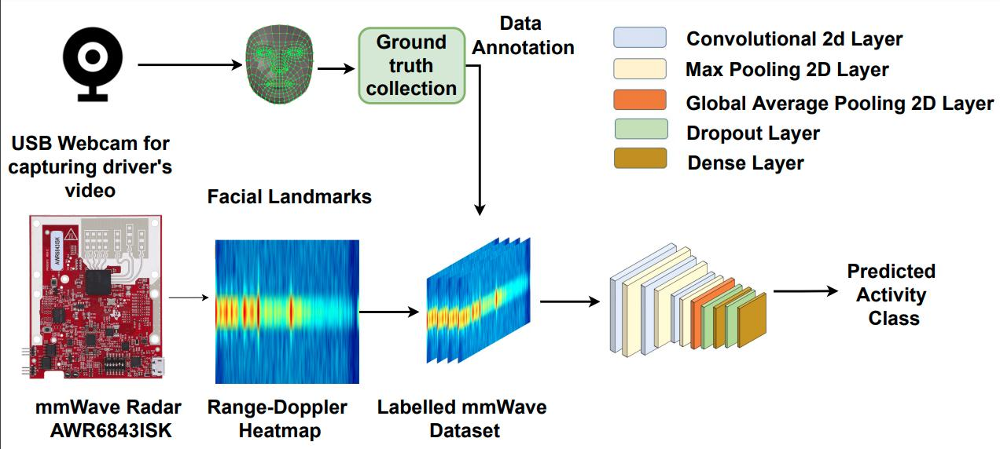

# mmAssist : Passive Monitoring of Driver’s Attentiveness Using mmWave Sensors
Continuous monitoring of driver attentiveness inside a car has been of significant importance for quite some time. However, the state-of-the-art  are primarily inclined toward image-based data, which is invasive and, therefore, could pose challenges in the pervasive adoption of such a system. This work proposes a novel approach for continuous driver attentiveness monitoring, leveraging millimeter Wave (mmWave) sensing to address that. The sensing infrastructure is compact, lightweight, and bears the exclusive potential to be adopted in a pervasive manner due to the continuously increasing popularity of mmWave hardware with 5G technology. We study the driver’s attention as a multi-class problem and address that using Range Doppler information from an mmWave radar. We evaluate the proposed methodologies in a lab and a real-world driving scenario. Within the lab-based setup, we achieved an accuracy of 88%, whereas, in the real-world system, we could achieve an accuracy of up to 79% while monitoring the driver’s activities
associated with driving attentiveness.

      

For questions and general feedback, contact Argha Sen (arghasen10@gmail.com).
